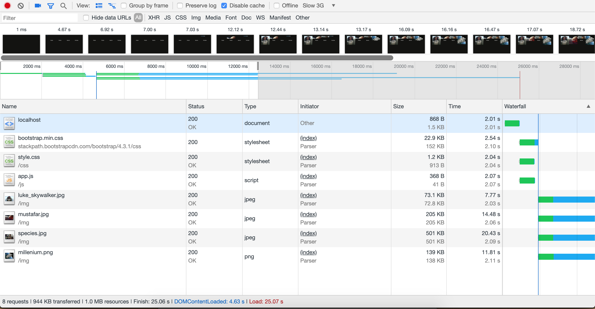
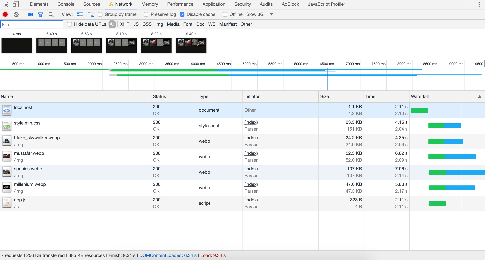
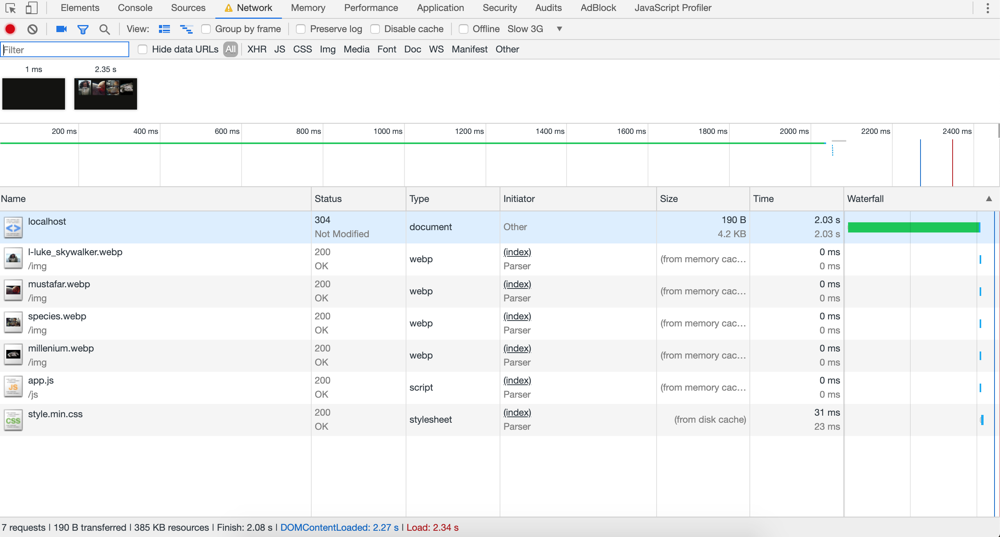
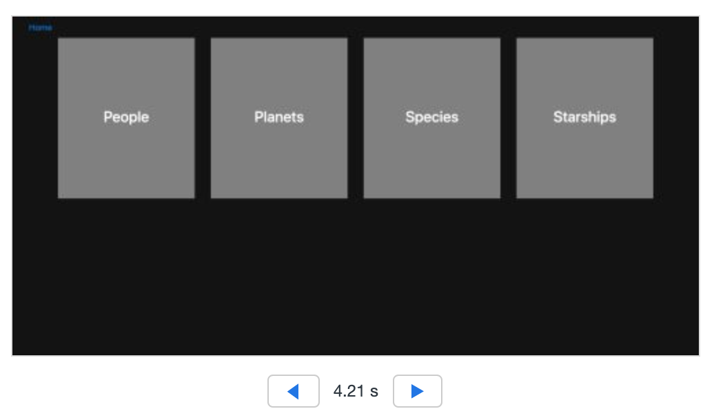
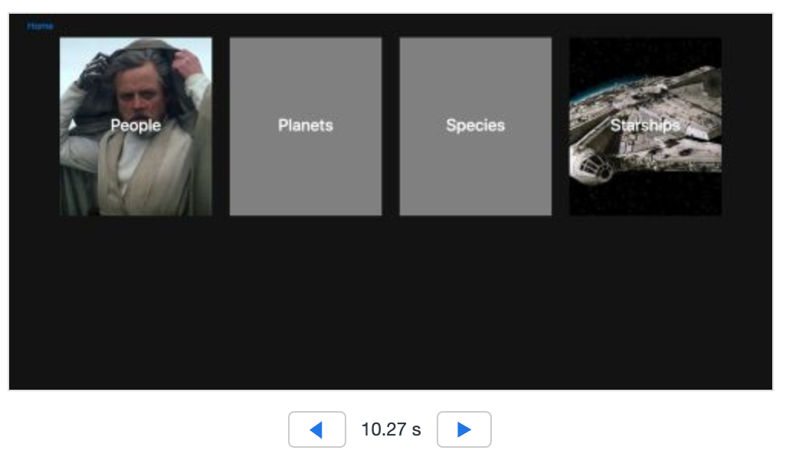
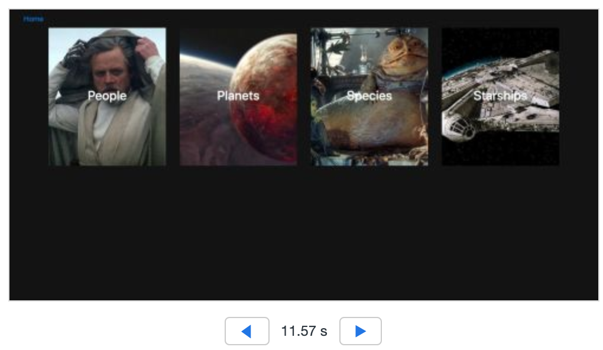

# Performance Matters @cmda-minor-web · 2018-2019
### App
Voor dit vak heb ik de webapp die ik in het vorige blok bij Web Apps From Scratch heb gemaakt geoptimaliseerd.

### Optimize runtime
__Niet geoptimaliseerde runtime op traag 3G netwerk__


__Wel geoptimaliseerde runtime op traag 3G netwerk, met cache disabled__


Voor deze optimalisatie heb ik gebruik gemaakt van: 
* g-zip compression
* CSS minify

__Wel geoptimaliseerde runtime op traag 3G netwerk, met cache enabled__


### Perceived performance
  


### Image loading
Door gebruik te maken van ``srcset=" "`` geef ik per viewport width aan welke image de browser moet tonen zodat hij op een klein scherm ook een kleinere image laat zien.
Die code ziet er vervolgens zo uit:<br/>
``` 
<picture>
       <source type="image/webp" srcset="/img/l-luke_skywalker.webp" media="(min-width: 992px)">
       <source type="image/webp" srcset="/img/m-luke_skywalker.webp" media="(min-width: 768px)">
       <source type="image/webp" srcset="/img/s-luke_skywalker.webp">
       <source srcset="/img/l-luke_skywalker.jpg" media="(min-width: 992px)">
       <source srcset="/img/m-luke_skywalker.jpg" media="(min-width: 768px)">
       <source srcset="/img/s-luke_skywalker.jpg">
       
</picture>```
